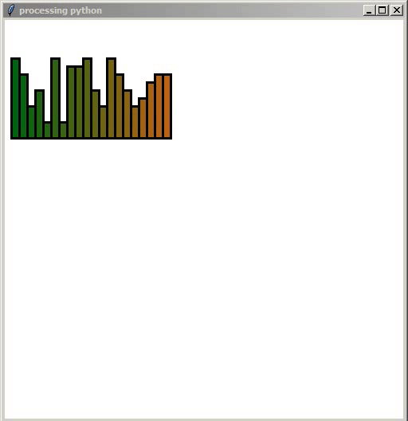
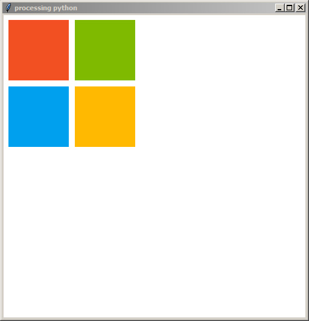
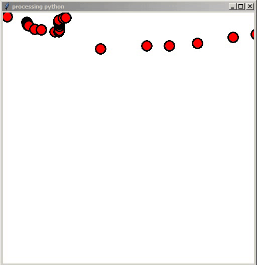
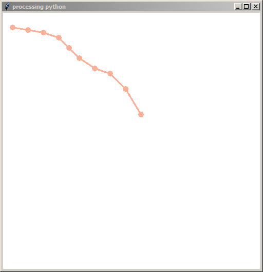
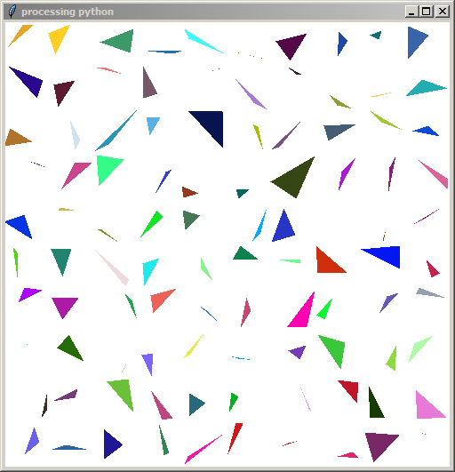

# ppython
Implementation of [processing.org](https://www.processing.org)'s processing in pure python (processing.py runs on jython, this one runs on **pure** python). No dependency, no import and no run()

# Info

Release name: omri

stability: alpha, highly volatile, more to be completed

# Running

```
cd ppython/ppython
python ppython.py <path-to-file>/file.py
```

# History

Had this project around, removed it from the fossils graveyard when Dr. Omri Har-Shemesh came to our Python meetup, inspired by his high physics background, i was reminded of this in my cupboard and decided to open it to the world.

Please don't see the source code (ppython.py) else you'll chase me out of the Python kingdom

# Why a pure python version?

To simply take advantage of the huge number of machine learning, data science and normal packages available

# How is this different from p5py?

- no dependency

requires only tkinter

- no imports

you only run your code as it should. no from x import *

- no run()

no need to call run() at the end

# Dependencies

```python
>>> dependencies is None
True
```

Absolutely no dependency

# Gallery

Here are some snippets:

## Sound Bars

```
python ppython.py snippets/soundbars.py
```



code:

```python
def setup():
    pass

def draw():
    background(255, 255, 255)
    for i in range(20):
        ry = random(2, 10)*10
        fill(i*10, 100, 20)
        rect(10 + i*10, 150-ry, 10, ry)
        fill(255, 0, 0)
```

## Microsoft Logo

```
python ppython.py snippets/winlogo.py
```



code:

```python
def setup():
    size = 100
    noStroke()

    fill(245, 80, 35)
    rect(10, 10, size, size)

    fill(125, 185, 0)
    rect(120, 10, size, size)

    fill(0, 160, 240)
    rect(10, 120, size, size)

    fill(255, 185, 0)
    rect(120, 120, size, size)

def draw():
    pass
```

## Paint

```
python ppython.py snippets/paint.py
```



code:

```python
def setup():
    pass

def draw():
    fill(255, 0, 0)
    ellipse(mouseX, mouseY, 20, 20)
```

## Line Graph

```
python ppython.py snippets/line_graph.py
```



code:

```python
coords = [
    (20, 30),
    (50, 35),
    (80, 40),
    (110, 50),
    (130, 70),
    (150, 90),
    (180, 110),
    (210, 120),
    (240, 150),
    (270, 200)
]

def setup():
    global coords
    noStroke()
    for coord in coords:
        x = coord[0]; y = coord[1]
        fill(255, 175, 150)
        ellipse(x-5, y-5, 10, 10)
    stroke(255, 175, 150)
    strokeSize(3)
    for i, coord in enumerate(coords):
        if i+1 < len(coords):
            x = coord[0]; y = coord[1]
            x2 = coords[i+1][0]; y2 = coords[i+1][1]
            line(x, y, x2, y2)

def draw():
    pass
```

## Brownian Motion

```
python ppython.py snippets/brownian_motion.py
```


code:

```python
class Particle:
    def __init__(self, x, y, r=10, vx=1, vy=1, randv=False):
        self.x = x
        self.y = y
        self.r = r
        self.vx = vx
        self.vy = vy

        if randv:
            rand1 = random(0, 1)
            rand2 = random(0, 1)
            if rand1:
                self.vx *= -1
            if rand2:
                self.vy *= -1


    def draw(self):
        noStroke()
        fill(140,70,20)
        ellipse(self.x, self.y, self.r, self.r)

    def update(self):
        self.x += self.vx
        self.y += self.vy

    def check_bounds(self):
        global width
        if self.x > width-self.r or self.x-self.r < 0:
            self.vx *= -1
        if self.y > height-self.r or self.y-self.r < 0:
            self.vy *= -1

    def run(self):
        self.update()
        self.check_bounds()
        self.draw()

particles = [Particle(
                random(0, width), random(0, width), vx=2, vy=2, randv=True)
            for i in range(200)]
def setup():
    pass

def draw():
    global particles
    background(255, 255, 255)
    for p in particles:
        p.run()
```

## Grid Triangles

```
python ppython.py snippets/rand_triangles.py
```



code:

```python
def triangle(x1, y1, x2, y2, x3, y3):
    beginShape()
    vertex(x1, y1)
    vertex(x2, y2)
    vertex(x3, y3)
    endShape()

def setup():
    background(255)
    noStroke()
    for x in range(0, width, 50):
        for y in range(0, width, 50):
            fill(random(0, 255), random(0, 255), random(0, 255))
            triangle(
                random(x, x+50),
                random(y, y+50),
                random(x, x+50),
                random(y, y+50),
                random(x, x+50),
                random(y, y+50)
                )

def draw():
    pass
```

# Docs

- setup()

Used to initialise what will be used only once

- draw()

code to be looped is placed in it

- line()

```python
line(x1, y1, x2, y2)
```

- rect()

```python
rect(x, y, width, height)
```

- ellipse()

```python
ellipse(x, y, width, height)
```

- background()

```python
background(r, g, b)
background(r, g, b, a)
background(grayness) # background(100) equals background(100, 100, 100)
```

- fill()

```python
fill(r, g, b)
fill(r, g, b, a)
fill(grayness) # fill(100) equals fill(100, 100, 100)
```

Used to colour shapes

- stroke()

```python
stroke(r, g, b)
stroke(r, g, b, a)
stroke(grayness) # stroke(100) equals stroke(100, 100, 100)
```

Used to colour lines and boarders of shapes

- strokeSize()

```python
strokeSize(thickness)
```

Used to define borders of shapes

- noFill()

```python
noFill()
```

Removes filling

- noStroke()

```python
noStroke()
```

Removes strokes

- random()

```python
random(end) # same as random(0, end)
random(start, end)
random() # returns arbitrary value from 0 to 1
```

Returns integer inclusive of start, exclusive of end

- beginShape()

```python
beginShape()
vertex(x1, y1)
vertex(x2, y2)
vertex(x3, y3)
endShape()
```
- mouseX

position of x-coord of mouse

- mouseY

position of y-coord of mouse